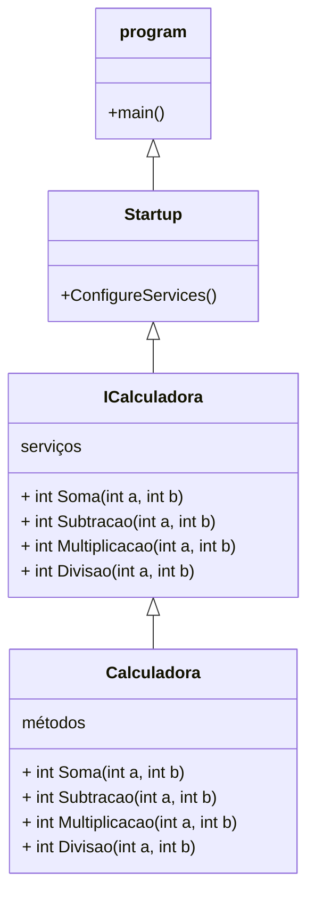

# Exemplo Calculadora

Este é um exemplo simples de uma calculadora em C# usando injeção de dependência.

##                              Diagrama de classes

```mermaid

classDiagram
   
    ICalculadora <|-- Calculadora
        
    Startup <|-- ICalculadora

    program <|-- Start up

    class program{
      +main()
    }
      class Startup{
      +ConfigureServices()
    }
      class ICalculadora{
        serviços
        + int Soma(int a, int b)
        + int Subtracao(int a, int b)
        + int Multiplicacao(int a, int b)
        + int Divisao(int a, int b)
    }
      class Calculadora{
        métodos
         + int Soma(int a, int b)
        + int Subtracao(int a, int b)
        + int Multiplicacao(int a, int b)
        + int Divisao(int a, int b)
    }

```

